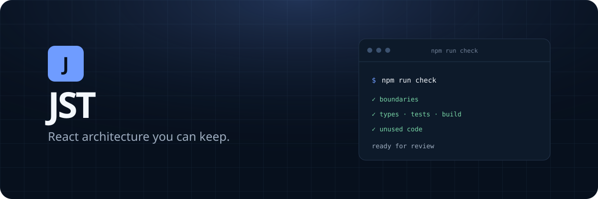

<p align="center">
  
</p>

<p align="center">
  <a href="https://github.com/jst-stack/jst/actions/workflows/ci.yml"></a>
  
  
  <a href="LICENSE"></a>
</p>

# JST

An architecture-first React starter for products that need server rendering, explicit dependency boundaries, typed data flow, and enforceable quality gates from the first commit.

## Quick start

Create a project with the official initializer:

```bash
npm create jst@latest my-app
cd my-app
npm run dev
```

The initializer configures the project, installs dependencies, and starts from the clean application shell.

## Showcase

The full architecture walkthrough and working API/persistence flows live in the independent [JST Showcase](https://github.com/jst-stack/jst-showcase), pinned here as the `showcase` Git submodule. Generated applications do not include it.

## Included

- React 19 and React Router framework-mode SSR
- TypeScript, Vite, and filesystem route discovery
- Dependency injection with request-scoped composition and auto-discovered providers
- A documented path for repository, DTO validation, mapper, service, view-model, entry, and props-driven view boundaries
- CSS Modules, Stylelint, SVG sprites, Vitest, Playwright, Axe, ESLint boundaries, React Doctor, Knip, Husky, and lint-staged

## Architecture

```text
app → pages → widgets → features → entities → shared
```

Dependencies point toward stable policy. Pages compose the application, features own user outcomes, entities own domain behavior and I/O contracts, and `shared` contains product-agnostic infrastructure only.

Read [Architecture](docs/architecture.md) before adding a non-trivial vertical slice. Coding agents should follow [the repository architecture skill](skills/frontend-architecture/SKILL.md).

## Commands

| Command | Purpose |
| --- | --- |
| `npm run dev` | Start the SSR development server |
| `npm run build` | Type-check and create production client/server builds |
| `npm run test:unit` | Run unit and integration tests once |
| `npm run test:e2e` | Run browser contracts and accessibility checks |
| `npm run lint` | Check code, styles, and architecture boundaries |
| `npm run doctor` | Diagnose React correctness and maintainability issues |
| `npm run check` | Run the complete local CI gate |
| `npm run create:slice -- entity account` | Create a canonical entity, feature, or widget slice |
| `npm run template:setup` | Configure the new product |

## Project policy

- [Contributing](CONTRIBUTING.md)
- [Security](SECURITY.md)
- [MIT License](LICENSE)

Maintained by [@antonbelous0v](https://github.com/antonbelous0v).
